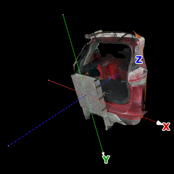
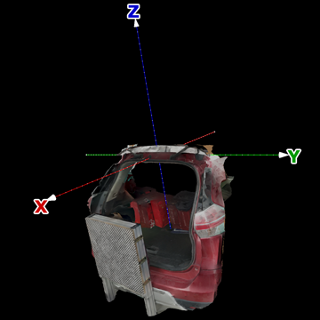

# 坐标对齐

尾门三维重建需要在不拆解的情况下得到车体和尾门两个部分，以及连接两个部分的铰链轴的位置。

识别参考板后得到的相机位姿，对应的坐标系，以参考板中心为原点，沿行向右为 X 轴正方向，沿列向下为 Y 轴正方向，向内为 Z 轴正方向。最终模型的坐标系则以铰链轴和车中间面的交点为原点，垂直车中间面（沿铰链轴）向右为 Y 轴正方向，沿车中间面和参考板平面交线向上为 Z 轴正方向，垂直 Y-Z 平面向前为 X 轴正方向。

| 对齐前                             | 对齐后                            |
|:----------------------------------:|:---------------------------------:|
|  |  |

从参考板坐标系到铰链坐标系的变换分为四步：

1. 微调相机位姿，进一步对齐图像（使特征匹配得到最大重合），这一过程后的新坐标系会和参考板坐标系有微小的偏移；
2. 识别车中间面（对称面），新坐标系以原 X 轴和车中间面的交点为原点，各坐标轴方向同铰链坐标系；
3. 识别铰链轴，新坐标即铰链坐标系，以车身和尾门为对象分别对齐，其中尾门对齐时会将各组开度的尾门对齐到第一组的位置（旋转车体）；
4. 识别关门位置，将尾门模型旋转到关门状态。

这四步都是通过变换相机位姿实现识别对象的最大重合，有一定共性，在此一并叙述。

最典型的是车中间面和铰链轴的识别。车中间面的识别，就是寻找一个平面，使得车体按平面镜像后，与原车体最大重合。铰链轴的识别，就是寻找一条（垂直于车中间面的）直线，以及各组图像之间的相对开度，使得各组分别绕直线旋转相应开度后，尾门最大重合。

这两个识别过程是类似的，有两种截然不同的解决思路。

* 基于三维点云最大重合（各点和最近点的距离尽量小），采用类似 [ICP](https://en.wikipedia.org/wiki/Iterative_closest_point) 的算法；
* 基于二维特征最大重合（各点和匹配[极线](https://en.wikipedia.org/wiki/Epipolar_geometry#Epipolar_line)的距离尽量小）。

基于三维点云最大重合的方法除了可以识别车中间面和铰链轴，还可以识别关门位置；基于二维特征最大重合的方法除了可以识别车中间面和铰链轴，还可以微调相机位姿。

两种方法理论上都存在不小的误差。三维点云的生成会引入一些误差，点云的稀疏也会造成一些误差；而二维特征点精度亦有限，且噪声更大，或者说正确匹配占的比例很小，在对齐前也难以分辨哪些才是正确的匹配。一些不太严谨的试验表明，三维点云方案稍好，不过这也可能是二维特征方案没有经过充分的优化的缘故。

## 三维点云对齐

三维点云的对称面识别可以参考 [Benoît Combès 的 Automatic symmetry plane estimation of bilateral objects in point clouds](https://ieeexplore.ieee.org/document/4587605/)。Liftgate3DReconstruction 的思路类似，不过因为该论文的概率计算实现起来过于复杂，Liftgate3DReconstruction 的优化目标是：

```math
\max\limits_K \sum\limits_r \exp - \frac{r^2(K)}{2 \sigma^2}
```

* $`K`$：优化参数，比如车中间面；
* $`r`$：需要对齐的距离，三维点云对齐时是指各点和对齐目标上的最近点的（欧式）距离；
* $`\sigma`$：对齐的容忍尺度，类似 Benoît Combès 方法，需要通过多次迭代逐步减小尺度。

## 二维特征对齐

二维特征对齐的目标函数形式上类似三维点云，但此时 $`r^2`$ 表示左图像上点与极线的距离平方，加上右图像上点与极线的距离平方。需要计算任意两图像间的任意匹配特征的 $`r^2`$。

## 相机位姿微调

参考板识别可以得到亚像素精度的网格位置，然后标定出很高精度的相机位姿。不过即便如此，只要相机角度有 0.005° 的偏差，2 m 外的测量目标就会有 1 mm 的误差。画面中距离参考板越远的地方，误差就会越大。为了减少这一误差，需要基于二维特征匹配的最大重合来微调相机位姿。

## 车中间面识别

绝大部分车型都是左右对称的，最终模型坐标系的原点即对称面和铰链轴的交点。对称面，也就是车中间面的识别基本上是以 Y-Z 平面为初值的局部优化过程。不过还是要注意两点。首先，为了保证点云有足够的密度，需要使用密集点云。然后，点云中包含车体之外的内容，比如参考板和周围环境，这些都是不关于车中间面对称的，识别对称面之前需要尽可能移除。

### 对称点

对于车中间面

```math
\begin{bmatrix}
   a & b & c
\end{bmatrix}
\begin{bmatrix}
   x \\
   y \\
   z
\end{bmatrix}
+ d = 0 \space , \space \space
\begin{bmatrix}
   a & b & c
\end{bmatrix}
\begin{bmatrix}
   a \\
   b \\
   c
\end{bmatrix}
= 1
```

车体上的点 $`x_o, y_o, z_o`$ 的对称点为

```math
\begin{bmatrix}
   x_o' \\
   y_o' \\
   z_o'
\end{bmatrix}
=
\begin{bmatrix}
   x_o \\
   y_o \\
   z_o
\end{bmatrix}
-
2
\left(
\begin{bmatrix}
   a & b & c
\end{bmatrix}
\begin{bmatrix}
   x_o \\
   y_o \\
   z_o
\end{bmatrix}
+
d
\right)
\begin{bmatrix}
   a \\
   b \\
   c
\end{bmatrix}
```

### 镜像图像

水平镜像后的图像中的车体可以看作相机关于车中间面对称的镜像相机拍出来的，图像中车体上的点与镜像图像中的对称点可用于重构一个三维点。

原图像点 $`x_i, y_i`$ 在水平镜像图像中的位置为

```math
\begin{bmatrix}
   x_i' \\
   y_i'
\end{bmatrix}
=
\begin{bmatrix}
   -1 & \\
   & 1
\end{bmatrix}
\left(
\begin{bmatrix}
   x_i \\
   y_i
\end{bmatrix}
-
\begin{bmatrix}
   P_x \\
   P_y
\end{bmatrix}
\right)
+
\begin{bmatrix}
   P_x \\
   P_y
\end{bmatrix}
=
\begin{bmatrix}
   2 P_x - x_i \\
   y_i
\end{bmatrix}
```

镜像相机的旋转矩阵为

```math
R'
=
\begin{bmatrix}
   -1 & & \\
   & 1 & \\
   & & 1
\end{bmatrix}
R M
```

镜像相机位置为

```math
C' =
M C
-2 d
\begin{bmatrix}
   a \\
   b \\
   c
\end{bmatrix}
```

其中

```math
M = I - 2
\begin{bmatrix}
   a \\
   b \\
   c
\end{bmatrix}
\begin{bmatrix}
   a & b & c
\end{bmatrix}
```

## 铰链轴识别

和车中间面识别相比，铰链轴的准确识别要困难一些。

其中一个原因是尾门只占画面的小部分，而且在这一阶段无法准确分离尾门和车身，这导致存在一个局部最优解：各组相对开度为 0，铰链轴为任意直线。解决方法是计算评价函数时根据铰链轴参数去掉非尾门部分：基于二维特征的方法可以去掉铰链轴投影直线以下的内容；基于三维点云的方法可以去掉铰链轴与参考板上沿构成的平面以下的内容。这种筛选方法也是有缺陷的，因为拍摄环境中也存在铰链轴以上的，像车体一样保持静止的背景物体。基于三维点云的方法可以基于与参考板的距离来过滤这些点，不过基于二维特征的方法就不容易了。所以基于三维点云辨识铰链轴的成功率更高一些，而基于二维特征的方法容易陷于和实际情况偏差非常大的局部最优解。

另一个原因是，尾门可能会发生弹性形变，而不是真正的刚体，三维重建总是假定对象是刚体，和事实不符，导致真实的铰链轴和相对开度可能不处于评价函数的最优解，而是被分散成了附近零散的一系列局部最优解，即便知道真实的铰链轴和相对开度也无法在接下来的环节准确建立三维模型。对于刚体模型，$`\sigma`$ 可以有比较宽的取值范围，十倍以内对于对齐结果（比如铰链轴位置）几乎没有影响，但发生弹性形变后，$`\sigma`$ 的微小改变都可能对对齐结果有很大影响。总之目前的三维重建技术无法解决尾门的弹性形变问题，弹性形变可能导致铰链轴位置出现非常大的偏差（可能超过 10 mm）。

## 关门位置识别

由于无法像各组开度一样拍摄关门时的尾门，只能基于三维点云的最大重合来识别关门位置。关门时车身和尾门重合的部分主要是尾门边缘，此外附近还有两个明显的局部最优解，一个是密封条的重合（此时门没关上），另一个是尾门和车体主体部分的重合（此时为负开度）。

目前的解决方法是，评估距离时不光考虑点的三维坐标，还要考虑法线方法，也就是在基于六维点云的最大重合来识别关门位置。不过也无法保证这种方法适合所有车型。
