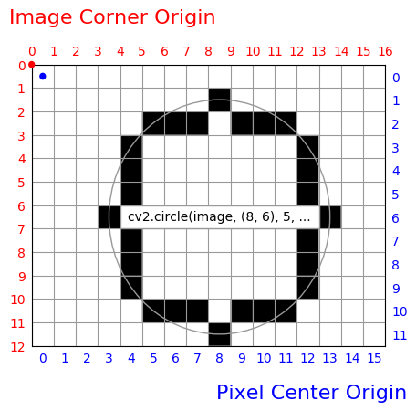

# 相机投影

## 无镜头畸变，像素长宽比 1 的投影

```math
\frac{z_c}{f}
\left(
\begin{bmatrix}
   x_i \\
   y_i \\
   f
\end{bmatrix}
-
\begin{bmatrix}
   P_x \\
   P_y \\
   0
\end{bmatrix}
\right)
=
z_c
\begin{bmatrix}
   x_p \\
   y_p \\
   1
\end{bmatrix}
=
\begin{bmatrix}
   x_c \\
   y_c \\
   z_c
\end{bmatrix}
=
\begin{bmatrix}
   &   & \\
   & R & \\
   &   &
\end{bmatrix}
\left(
\begin{bmatrix}
   x_o \\
   y_o \\
   z_o
\end{bmatrix}
-
\begin{bmatrix}
   C_x \\
   C_y \\
   C_z
\end{bmatrix}
\right)
```

* $`x_o, y_o, z_o`$：世界坐标系下的三维坐标；
* $`x_c, y_c, z_c`$：相机坐标系下的三维坐标；
* $`x_p, y_p`$：相机坐标系下的二维坐标；
* $`x_i, y_i`$：图像坐标系下的二维坐标；
* $`C_x, C_y, C_z`$：世界坐标系下的相机位置；
* $`R`$：相机旋转矩阵；
* $`P_x, P_y`$：图像坐标系下的主轴坐标；
* $`f`$：像素焦距。

## 与 OpenMVG 的关系

这里的 $`R`$ 和 $`C`$ 与 OpenMVG 定义相同（sfm_data.json 文件 `extrinsics` 记录的 `rotation` 和 `center` 项）。

## 与 OpenCV 的关系

```python
R = cv2.Rodrigues(rvec)[0]
C = -np.dot(tvec.ravel(), R)
rvec = cv2.Rodrigues(R)[0]
tvec = -np.dot(R, C)
fx = fy = f
cx = Px
cy = Py
```

### 参考资料

* [OpenCV Camera Calibration and 3D Reconstruction](https://docs.opencv.org/3.4.1/d9/d0c/group__calib3d.html#details)

## 与 Blender 的关系

```python
from robotmath import Rotation3, Vector3
from mathutils import Euler
camera.rotation_euler = Euler(Rotation3.from_vector(Vector3(*rvec.ravel())).to_euler(), "XYZ")
camera.location = tuple(tvec.ravel())
camera.angle = max(np.arctan2(cx, fx), np.arctan2(cy, fy)) * 2
```

这里假定主轴位于图像中心。

## 与 RobotMath 的关系

OpenCV 的 `Rodrigues` 函数

```python
R, J = cv2.Rodrigues(np.array([a, b, c], dtype=float))
```

等价于

```python
from robotmath import Rotation3, Vector3, tangent_to_derivative, dexp
r = Vector3(a, b, c)
R = Rotation3.from_vector(r)
J = np.reshape([tangent_to_derivative(R, dexp(r, Vector3(1, 0, 0))),
                tangent_to_derivative(R, dexp(r, Vector3(0, 1, 0))),
                tangent_to_derivative(R, dexp(r, Vector3(0, 0, 1)))],
               (3, 9))
R = np.reshape(R, (3, 3))
```

### 算法

```math
\begin{bmatrix}
   a \\
   b \\
   c
\end{bmatrix}
= \theta u
\space , \space \space
u \cdot u = 1
```

```math
\theta \left[ u \times \right] =
\begin{bmatrix}
    0 & -c &  b \\
    c &  0 & -a \\
   -b &  a  &  0
\end{bmatrix}
```

```math
R = I +
\left( sin \theta \right) \left[ u \times \right] +
\left( 1 - cos \theta \right) \left[ u \times \right]^2
```

```math
J =
\begin{bmatrix}
   \partial R_{flatten} / \partial a \\
   \partial R_{flatten} / \partial b \\
   \partial R_{flatten} / \partial c
\end{bmatrix}
```

### 参考资料

* [Rodrigues' rotation formula](https://en.wikipedia.org/wiki/Rodrigues'_rotation_formula)

## 与 OpenGL 的关系

OpenGL 通过 Modelview 和 Projection 两个矩阵，以及 `glViewport` 来定义相机。

OpenGL 默认的相机坐标系定义与 OpenCV、OpenMVG 的 z 轴和 y 轴方向相反。但如果分别用 `glLoadMatrixd` 定义 Modelview 和 Projection 矩阵，也可以让 OpenGL 采用 OpenCV 的相机坐标系定义。同时要注意 `glLoadMatrixd` 的行列顺序和 `numpy` 定义相反，转换时需要转置。

|            | OpenGL   | OpenCV   | OpenMVG  |
|:----------:|:--------:|:--------:|:--------:|
| x 轴正方向 | 图像右方 | 图像右方 | 图像右方 |
| y 轴正方向 | 图像上方 | 图像下方 | 图像下方 |
| z 轴正方向 | 图像外侧 | 图像内侧 | 图像内侧 |
| 图像原点   | 左下角   | 左上像素 | 左上像素 |

Modelview 矩阵对应 OpenCV 的旋转平移矩阵和 OpenMVG 的 `extrinsics` 项。

```math
\begin{bmatrix}
   x_c^\star \\
   y_c^\star \\
   z_c^\star \\
   1
\end{bmatrix}
=
\begin{bmatrix}
   &       & \\
   & Model & \\
   & view  & \\
   &       &
\end{bmatrix}
\begin{bmatrix}
   x_o \\
   y_o \\
   z_o \\
   1
\end{bmatrix}
```

当采用 OpenCV 定义时，

```math
\begin{bmatrix}
   x_c^\star \\
   y_c^\star \\
   z_c^\star \\
   1
\end{bmatrix}
=
\begin{bmatrix}
   x_c \\
   y_c \\
   z_c \\
   1
\end{bmatrix}
```

```math
\begin{bmatrix}
   &       & \\
   & Model & \\
   & view  & \\
   &       &
\end{bmatrix}
=
\begin{bmatrix}
   &   & & \\
   & R & & T \\
   &   & & \\
   &   & & 1
\end{bmatrix}
```

其中 $`T = -R C`$，即 OpenCV 的 `tvec`。

当采用 OpenGL 默认定义时，

```math
\begin{bmatrix}
   x_c^\star \\
   y_c^\star \\
   z_c^\star \\
   1
\end{bmatrix}
=
\begin{bmatrix}
   x_c \\
   -y_c \\
   -z_c \\
   1
\end{bmatrix}
```

OpenCV 和 OpenGL 默认定义之间可以采用以下方式转换：

```math
\begin{bmatrix}
   &            & \\
   & Model      & \\
   & view^\star & \\
   &            &
\end{bmatrix}
=
\begin{bmatrix}
   1 &    &    & \\
     & -1 &    & \\
     &    & -1 & \\
     &    &    & 1
\end{bmatrix}
\begin{bmatrix}
   &       & \\
   & Model & \\
   & view  & \\
   &       &
\end{bmatrix}
```

Projection 矩阵和 `glViewport` 对应 OpenCV 的相机矩阵和 OpenMVG 的 `intrinsics` 项。

```math
w
\begin{bmatrix}
   x_n \\
   y_n \\
   z_n \\
   1
\end{bmatrix}
=
\begin{bmatrix}
   &       & \\
   & Proje & \\
   & ction & \\
   &       &
\end{bmatrix}
\begin{bmatrix}
   x_c^\star \\
   y_c^\star \\
   z_c^\star \\
   1
\end{bmatrix}
```

Projection 矩阵将点投影映射到 $`x_n, y_n, z_n`$，这三个坐标值在 -1 和 1 之间的点才会被渲染。

`glViewport(x, y, width, heigt)` 将 $`x_n, y_n`$ 转换为图像坐标：

```math
x_i = \left( x_n + 1 \right) \frac{width}{2} + x
```

```math
y_i = \left( y_n + 1 \right) \frac{height}{2} + y
```

`glDepthRange(near, far)` 将 $`z_n`$ 转换为深度通道数值（浮点深度通道时，而整型深度通道的数值为该数值乘以整型类型的最大值）：

```math
z_i = \left( z_n + 1 \right) \frac{far - near}{2} + near
```

默认 `near` 为 0，`far` 为 1，注意这并非实际长度尺度，和长度尺度也未必是线性关系（一般来说正交投影时才是线性）。

`gluPerspective(fovy, aspect, near, far)` 定义的 Projection 矩阵为：

```math
\begin{bmatrix}
   &       & \\
   & Proje & \\
   & ction & \\
   &       &
\end{bmatrix}
=
\begin{bmatrix}
   \frac{1}{aspect} \cot{\frac{fovy}{2}} & & & \\
   & \cot{\frac{fovy}{2}} & & \\
   & & \frac{near + far}{near - far} & \frac{2 near far}{near - far} \\
   & & -1 &
\end{bmatrix}
```

此时若采用默认的 `glDepthRange(0, 1)`，深度通道 $`z_i`$ 和实际深度 $`z_c`$ 的关系为：

```math
\frac{1}{z_c} = -\frac{1}{z_c^\star} =
\left( \frac{1}{far} - \frac{1}{near} \right) z_i + \frac{1}{near}
```

`glOrtho(left, right, bottom, top, near, far)` 定义的 Projection 矩阵为：

```math
\begin{bmatrix}
   &       & \\
   & Proje & \\
   & ction & \\
   &       &
\end{bmatrix}
=
\begin{bmatrix}
   \frac{2}{right - left} & & & \frac{left + right}{left - right} \\
   & \frac{2}{top - bottom} & & \frac{bottom + top}{bottom - top} \\
   & & \frac{2}{near - far} & \frac{near + far}{near - far} \\
   & & & 1
\end{bmatrix}
```

此时若采用默认的 `glDepthRange(0, 1)`，深度通道 $`z_i`$ 和实际深度 $`z_c`$ 的关系为：

```math
z_c = -z_c^\star =
\left( far - near \right) z_i + near
```

OpenCV 和 OpenGL 默认定义之间可以采用以下方式转换：

```math
\begin{bmatrix}
   &             & \\
   & Proje       & \\
   & ction^\star & \\
   &             &
\end{bmatrix}
=
\begin{bmatrix}
   &       & \\
   & Proje & \\
   & ction & \\
   &       &
\end{bmatrix}
\begin{bmatrix}
   1 &    &    & \\
     & -1 &    & \\
     &    & -1 & \\
     &    &    & 1
\end{bmatrix}
```

### 参考资料

* [OpenGL Projection Matrix](http://www.songho.ca/opengl/gl_projectionmatrix.html)

## 图像坐标系

不同软件的图像坐标系定义有些区别。

一个区别是 y 轴正方向：

* 图像上方，如 OpenGL；
* 图像下方，如 OpenCV、OpenMVG、Direct3D、Photoshop。

另一个区别是像素原点：

* 第一个像素中心，包括 OpenCV 的大部分函数、OpenMVG（二维特征）、Direct3D 9；
* 图像边角，包括 OpenGL、Direct3D 10+。



Liftgate3DReconstruction 参照 OpenCV 惯例，以左上像素中心为原点。宽度为 $`w`$，高度为 $`h`$ 的图像，中心（默认主轴）为 $`(w - 1) / 2, (h - 1) / 2`$。

### 参考资料

* [Direct3D 9/10 Coordinate Systems](https://msdn.microsoft.com/en-us/library/windows/desktop/cc308049%28v=vs.85%29.aspx)

## 球透视投影

球铰识别时需要考虑球投影问题。相机和球的切线构成一个圆锥面，视平面是圆锥的截面，所以球在图像中的投影是一个椭圆。

相机坐标系下球心为 $`x_c, y_c, z_c`$，半径为 $`r`$ 的球在图像中投影椭圆的两个焦点的坐标分别为：

```math
\frac{f}{z_c + r}
\begin{bmatrix}
   x_c \\
   y_c
\end{bmatrix}
+
\begin{bmatrix}
   P_x \\
   P_y
\end{bmatrix}
\space , \space\space
\frac{f}{z_c - r}
\begin{bmatrix}
   x_c \\
   y_c
\end{bmatrix}
+
\begin{bmatrix}
   P_x \\
   P_y
\end{bmatrix}
```

椭圆的半焦距、半短轴和半长轴分别为：

```math
\frac{f r \sqrt{x_c^2 + y_c^2}}{z_c^2 - r^2}
\space , \space\space
\frac{f r \sqrt{z_c^2 - r^2}}{z_c^2 - r^2}
\space , \space\space
\frac{f r \sqrt{x_c^2 + y_c^2 + z_c^2 - r^2}}{z_c^2 - r^2}
```

球越接近主轴，则投影越接近圆形。当 $`z_c \gg r`$ 时，与椭圆等面积的等效圆形，圆心为球心的投影，半径为：

```math
\frac{f r}{z_c}
\sqrt[4]{\frac{x_c^2 + y_c^2 + z_c^2}{z_c^2}}
```

### 鱼眼镜头

虽然在正常镜头下，球的投影是椭圆，但是在鱼眼镜头中，球的投影是圆形。由于圆形的识别比椭圆要简单得多，所以可以将正常图像转换为鱼眼图像来识别圆形，进而识别空间球体。

鱼眼图像坐标 $`x_i', y_i'`$ 和正常图像坐标 $`x_i, y_i`$的关系为：

```math
\frac{\theta}{f}
\left(
\begin{bmatrix}
   x_i \\
   y_i
\end{bmatrix}
-
\begin{bmatrix}
   P_x \\
   P_y
\end{bmatrix}
\right)
=
\theta
\begin{bmatrix}
   x_p \\
   y_p
\end{bmatrix}
=
\tan \theta
\begin{bmatrix}
   x_p' \\
   y_p'
\end{bmatrix}
=
\frac{\tan \theta}{f'}
\left(
\begin{bmatrix}
   x_i' \\
   y_i'
\end{bmatrix}
-
\begin{bmatrix}
   P_x' \\
   P_y'
\end{bmatrix}
\right)
```

```math
\theta = \arctan \sqrt{x_p^2 + y_p^2} = \sqrt{{x_p'}^2 + {y_p'}^2}
```

* $`P_x', P_y'`$：鱼眼镜头的主轴坐标；
* $`f'`$：鱼眼镜头像素焦距。

相机坐标系下球心为 $`x_c, y_c, z_c`$，半径为 $`r`$ 的球在鱼眼镜头中的投影圆半径为：

```math
f' \arcsin \frac{r}{\sqrt{x_c^2 + y_c^2 + z_c^2}}
```

### 参考资料

* [Automatic portion estimation and visual refinement in mobile dietary assessment](https://www.researchgate.net/publication/221744876)
