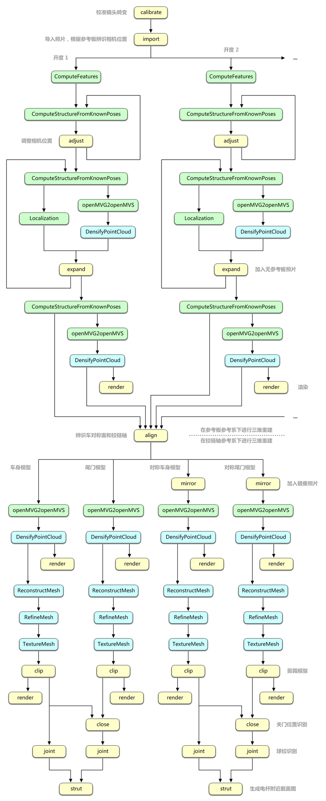

# 使用说明

## 系统需求

* Python 2.7+
* OpenCV 3.4+
* OpenMVG 1.3
* OpenMVS 0.7
* 16 G 以上内存（推荐 32 G 以上）

## 基本操作

可以在一个空文件夹下执行以下命令导入照片：

```
l3dr.py import camera.json 开度1路径 开度2路径 ...
```

执行后会在目录下生成 `run.bat` 批处理文件，其中包含了典型的三维重建流程。

## 工作流程

典型的三维重建流程如下（黄色为 Liftgate3DReconstruction 程序，绿色为 OpenMVG 程序，蓝色为 OpenMVS 程序）：


